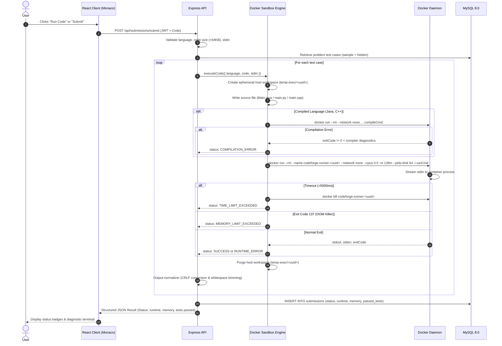

# CodeForge — Secure Online Code Execution & Coding Platform

[](LICENSE)
[](https://nodejs.org/)
[](https://react.dev/)
[](https://www.docker.com/)
[](https://www.mysql.com/)

CodeForge is a full-stack online judge and secure code execution platform built with **React**, **Node.js**, **Express**, **MySQL**, and **Docker**. Inspired by platforms like LeetCode and HackerRank, CodeForge provides an interactive browser IDE powered by Monaco Editor to write, test, and evaluate Python, Java, and C++ code against sample and hidden test suites inside ephemeral, resource-isolated Docker containers.

---

## 📸 Screenshots & UI Preview

```
+--------------------------------------------------------------------------------------------------+
|  [>] CodeForge Sandbox       Problems    Online Editor    Dashboard    Submissions    [Admin]     |
+--------------------------------------------------------------------------------------------------+
|  Two Sum (Easy)                         |  [ Python 3.11 v ]  [Reset]  [Run Code]  [Submit]      |
|                                         |--------------------------------------------------------|
|  Given an array of integers nums and an |  1  def two_sum(nums, target):                         |
|  integer target, return 0-based indices |  2      lookup = {}                                    |
|  of the two numbers that add to target. |  3      for i, num in enumerate(nums):                 |
|                                         |  4          diff = target - num                        |
|  Constraints:                           |  5          if diff in lookup:                         |
|  * 2 <= nums.length <= 10^4             |  6              return [lookup[diff], i]               |
|  * -10^9 <= nums[i] <= 10^9             |  7          lookup[num] = i                            |
|                                         |--------------------------------------------------------|
|  Examples:                              |  [ Sample Tests ]  [ Custom Input ]  [ Result ]        |
|  Input: nums = [2,7,11,15], target = 9  |  [PASS] Case 1: Input: [2,7,11,15], 9 -> Output: 0 1   |
|  Output: 0 1                            |  [PASS] Case 2: Input: [3,2,4], 6     -> Output: 1 2   |
|                                         |  Status: ACCEPTED | Runtime: 18ms | Memory: 16MB       |
+--------------------------------------------------------------------------------------------------+
```

---

## 🚀 Key Features

* **Multi-Language Sandboxing:** Securely compile and execute Python 3.11, OpenJDK 17 Java, and GCC 13 C++ inside ephemeral Docker containers.
* **Strict Resource Restrictions:** 128 MB RAM limits, 0.5 CPU quotas, max 64 PIDs (fork-bomb prevention), 5-second watchdog timeouts, and disabled networking (`--network none`).
* **Monaco Code Editor:** Browser IDE with syntax highlighting, automatic indentation, bracket matching, line numbers, and dark theme support.
* **Interactive Sandbox & Problem Solving:** Freeform code runner with custom standard input (stdin), plus 10 curated algorithmic problems spanning Easy, Medium, and Hard difficulties.
* **Automated Grading & Test Normalization:** Grades submissions against public sample test cases and protected hidden test suites, automatically handling CRLF conversions and trailing whitespace.
* **Submission History & Analytics:** Tracks runtime execution time (ms), memory usage (MB), test pass rates, and offers read-only code review modals for previous submissions.
* **Interactive Developer Dashboard:** Real-time analytics, 7-day submission volume charts powered by Recharts, and difficulty breakdown progress rings.
* **Role-Based Admin Panel:** Administrative interface with server-side authorization to create, edit, and delete problems and test cases.

---

## 🛠️ Technology Stack

| Layer | Technology |
| :--- | :--- |
| **Frontend** | React 18, Vite, JavaScript, Tailwind CSS, React Router v6, Axios, Monaco Editor, Lucide React, Recharts |
| **Backend** | Node.js, Express.js, JavaScript, REST APIs, JWT Authentication, bcryptjs, Helmet, Morgan, CORS |
| **Database** | MySQL 8.0 (Relational schema with InnoDB, foreign keys with CASCADE, optimized indexes) |
| **Code Execution** | Docker (Isolated ephemeral containers, non-root users, resource quotas) |

---

## 📂 Architecture Overview

```mermaid
flowchart TD
    subgraph ClientLayer ["Frontend Client (React + Vite)"]
        UI["Tailwind CSS Developer UI"]
        Monaco["Monaco Editor (vs-dark)"]
        Router["React Router v6"]
        AxiosClient["Axios HTTP Client + JWT Interceptors"]
    end

    subgraph ServerLayer ["Backend REST API (Node.js + Express)"]
        ExpressApp["Express.js Server"]
        AuthMid["JWT Authentication & RBAC Middleware"]
        Validators["Input Validation Layer"]
        Controllers["REST Controllers"]
        Services["Business Services (Auth, Problem, Execution, User)"]
    end

    subgraph SandboxLayer ["Docker Execution Sandbox"]
        ExecMgr["Docker Execution Manager"]
        TempWorkspace["Ephemeral Host Workspace (temp-exec/)"]
        DockerCLI["Docker CLI (docker run / kill / rm)"]
        JavaBox["codeforge-java Sandbox (Temurin 17 Alpine)"]
        PyBox["codeforge-python Sandbox (Python 3.11 Alpine)"]
        CppBox["codeforge-cpp Sandbox (GCC 13 Alpine)"]
    end

    subgraph DatabaseLayer ["Database Layer (MySQL 8.0)"]
        UsersTab["users"]
        ProblemsTab["problems"]
        TestCasesTab["test_cases (sample + hidden)"]
        SubmissionsTab["submissions"]
        ExecHistoryTab["execution_history"]
    end

    ClientLayer -->|HTTP REST / JSON (JWT)| ExpressApp
    ExpressApp --> AuthMid
    AuthMid --> Validators
    Validators --> Controllers
    Controllers --> Services
    Services -->|mysql2 connection pool| DatabaseLayer
    Services -->|Spawn & Monitor| ExecMgr
    ExecMgr --> TempWorkspace
    ExecMgr --> DockerCLI
    DockerCLI --> JavaBox
    DockerCLI --> PyBox
    DockerCLI --> CppBox
```

---

## 🔄 Code Execution Flow



---

## 🔒 Security & Sandboxing Approach

Executing arbitrary user-submitted code over the public web presents severe security risks. CodeForge enforces practical multi-layer containerized sandboxing:

1. **No Host Execution:** Arbitrary code is NEVER executed on the host server process.
2. **Network Isolation:** All containers run with `--network none`, preventing external network calls, socket scanning, or data exfiltration.
3. **Strict Resource Quotas:**
   * **RAM Limit:** 128 MB memory limit (`-m 128m --memory-swap 128m`).
   * **CPU Limit:** 0.5 CPU core quota (`--cpus 0.5`).
   * **Process Limit:** Max 64 PIDs (`--pids-limit 64`), completely neutralizing fork-bombs (`:(){ :|:& };:`).
4. **Watchdog Timers:** 5000ms wall-clock timeout with forceful container kill (`docker kill`).
5. **Non-Root Execution:** Container images run under restricted unprivileged user `runner` (uid 1001).
6. **Mount Isolation:** Containers only mount an ephemeral workspace (`temp-exec/<uuid>`); host root and the Docker socket (`/var/run/docker.sock`) are never mounted.
7. **Secret Isolation:** Host environment variables and database passwords are never passed into execution containers.
8. **Buffer Capping:** Standard output is capped at 64 KB; runaway print loops return `OUTPUT_LIMIT_EXCEEDED`.
9. **Ephemeral Cleanup:** Containers use `--rm` and workspace directories are deleted in `finally` blocks.
10. **Hidden Test Privacy:** Public endpoints strictly filter `test_cases` by `is_sample = TRUE`. Hidden inputs and outputs are never delivered to the browser.

---

## 💻 Supported Languages & Starter Templates

| Language | Version | Dockerfile Base | Compile Command | Run Command |
| :--- | :--- | :--- | :--- | :--- |
| **Python** | 3.11 | `python:3.11-alpine` | N/A (Interpreted) | `python -u main.py` |
| **Java** | OpenJDK 17 | `eclipse-temurin:17-jdk-alpine` | `javac Main.java` | `java -Xmx128m Main` |
| **C++** | GCC 13 (C++17) | `alpine:3.19` (g++, musl-dev) | `g++ -O2 main.cpp -o main` | `./main` |

---

## ⚙️ Environment Variables Reference

File: `server/.env` (see `.env.example` for templates)

```env
PORT=5000
NODE_ENV=development
CLIENT_URL=http://localhost:5173

# MySQL Database Configuration
DB_HOST=localhost
DB_PORT=3306
DB_USER=root
DB_PASSWORD="your_mysql_password"
DB_NAME=codeforge_db

# Authentication
JWT_SECRET=your_super_secret_jwt_key_at_least_32_characters_long
JWT_EXPIRES_IN=7d

# Code Execution Limits
EXECUTION_TIMEOUT_MS=5000
EXECUTION_MEMORY_LIMIT=128m
EXECUTION_CPU_LIMIT=0.5
EXECUTION_MAX_OUTPUT_BYTES=65536
EXECUTION_MAX_CODE_BYTES=65536
DOCKER_CONTAINER_PREFIX=codeforge-runner-

# Docker Sandbox Images
DOCKER_IMAGE_JAVA=codeforge-java:latest
DOCKER_IMAGE_PYTHON=codeforge-python:latest
DOCKER_IMAGE_CPP=codeforge-cpp:latest
```

---

## 🚀 Local Development Setup

### 1. Prerequisites
* **Node.js**: v18+ (tested on `v24.16.0`)
* **npm**: v9+ (tested on `v11.13.0`)
* **MySQL Server**: 8.0 running locally on port 3306
* **Docker Desktop**: (Installed and running with WSL2 on Windows, or Docker Engine on Linux/macOS)

### 2. Clone and Install Dependencies
```bash
git clone https://github.com/Lahari-333/CodeForge.git
cd CodeForge

# Install server dependencies
cd server
npm install

# Install client dependencies
cd ../client
npm install
```

### 3. Initialize MySQL Database
```bash
# Using Node seed script (recommended)
cd server
node src/db/seed.js

# Or using the MySQL CLI:
mysql -u root -p -e "CREATE DATABASE IF NOT EXISTS codeforge_db;"
mysql -u root -p codeforge_db < ../schema.sql
mysql -u root -p codeforge_db < ../seed.sql
```

#### Pre-Configured Seed Accounts:
* **Admin Account:** Username: `admin` | Password: `AdminPassword@123` | Role: `ADMIN`
* **Demo Developer:** Username: `demouser` | Password: `DemoPassword@123` | Role: `USER`

### 4. Build Docker Execution Sandbox Images
```bash
# Build Java runner
docker build -t codeforge-java:latest ./docker/java

# Build Python runner
docker build -t codeforge-python:latest ./docker/python

# Build C++ runner
docker build -t codeforge-cpp:latest ./docker/cpp
```

### 5. Start Backend & Frontend
In Terminal 1 (Backend):
```bash
cd server
npm run dev
# Server running at http://localhost:5000
```

In Terminal 2 (Frontend):
```bash
cd client
npm run dev
# Client running at http://localhost:5173
```

---

## 🧪 Testing Instructions

CodeForge includes a full Jest and Supertest suite verifying authentication, input validation, output normalization, RBAC permissions, and problem queries:

```bash
cd server
npm test
```

### Automated Test Results:
* `PASS tests/unit.test.js`
  * `normalizeOutput handles CRLF, trailing spaces, and blank lines`
  * `compareOutputs returns true for equivalent outputs with different line endings`
  * `compareOutputs returns false for different values`
  * `supported languages include java, python, cpp`
  * `execution statuses are all defined properly`
* `PASS tests/api.test.js`
  * `GET /api/health returns health status`
  * `POST /api/auth/register fails on password mismatch`
  * `POST /api/auth/register creates a new user successfully`
  * `POST /api/auth/register rejects duplicate registration`
  * `POST /api/auth/login rejects incorrect password`
  * `POST /api/auth/login logs in regular demo user`
  * `POST /api/auth/login logs in admin user`
  * `GET /api/auth/me rejects unauthenticated request (401)`
  * `GET /api/auth/me accepts authenticated request with token (200)`
  * `GET /api/problems lists seeded coding problems`
  * `GET /api/problems/two-sum returns problem and ONLY sample test cases (hidden tests protected)`
  * `POST /api/problems rejects non-admin user (403 Forbidden)`
  * `POST /api/problems allows ADMIN user (201 Created)`
  * `POST /api/execute rejects invalid language (400)`
  * `POST /api/execute rejects empty source code (400)`
  * `GET /api/users/profile returns user profile with statistics`
  * `GET /api/users/dashboard returns dashboard data`
* **Test Suites: 2 passed, 2 total**
* **Tests: 22 passed, 22 total**

---

## 🌐 Production Deployment Architecture

```
[ Developer Browser ]
         |
         | HTTPS
         v
[ Vercel Static Edge CDN ]  -----> Serves React 18 SPA (client/dist)
         |
         | REST API / HTTPS
         v
[ Cloud VM / VPS (Ubuntu LTS) ]
    ├── Nginx Reverse Proxy (SSL / Certbot)
    ├── Node.js Express API Process (systemd / PM2)
    └── Docker Engine Daemon
            ├── codeforge-java Sandbox Container (isolated)
            ├── codeforge-python Sandbox Container (isolated)
            └── codeforge-cpp Sandbox Container (isolated)
         |
         | TLS
         v
[ Managed MySQL Database (AWS RDS / PlanetScale / Aiven) ]
```

### Why a Dedicated VM / Docker-Enabled Host is Required for the Backend
Standard serverless or container PaaS platforms (such as Render Web Services or Vercel Serverless) operate inside confined containers without root daemon privileges or access to `/var/run/docker.sock`. Because CodeForge executes user code inside genuine, isolated Docker containers with `--network none` and `--cpus 0.5`, the backend requires a host environment that provides native Docker daemon access (e.g. AWS EC2, DigitalOcean Droplet, Hetzner, or a Docker-in-Docker capable VM).

---

## 🔗 Repository & Live Links

* **GitHub Repository:** [https://github.com/Lahari-333/CodeForge](https://github.com/Lahari-333/CodeForge)
* **Frontend Demo:** Deployable to Vercel via `client/`
* **Backend API Health Check:** `/api/health`

---

## ⚠️ Known Limitations & Future Improvements

### Known Limitations
* **Local Kernel Sharing:** Docker containers share the host Linux kernel. While practical and robust for developer environments, multi-tenant cloud judges (e.g. LeetCode) typically utilize micro-virtualization (AWS Firecracker or Google gVisor `runsc`) for hardware-level boundary isolation.
* **Windows Docker Desktop Dependency:** On Windows hosts, Docker Desktop must be running with WSL2 to execute code. If Docker is offline, CodeForge gracefully returns a structured `SYSTEM_ERROR` notification without crashing.

### Future Improvements
* WebSockets / SSE for live streaming of standard output during long executions.
* Google gVisor (`runsc`) OCI runtime integration for kernel-independent sandboxing.
* Memory usage sampling via cgroups v2 (`memory.current`).
* Contest mode and timed assessment challenges.

---

## 👤 Author

* **Developer:** Lahari ([@Lahari-333](https://github.com/Lahari-333))
* **Repository:** [https://github.com/Lahari-333/CodeForge](https://github.com/Lahari-333/CodeForge)
* **License:** MIT License
