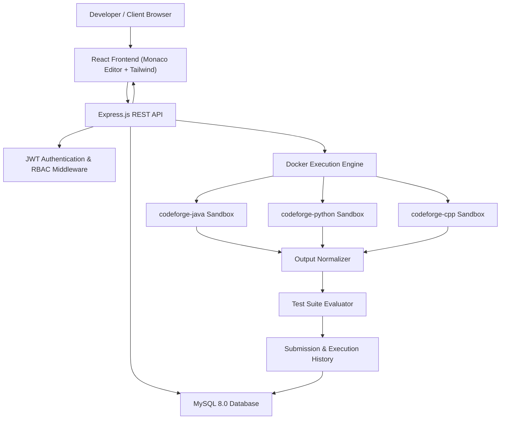
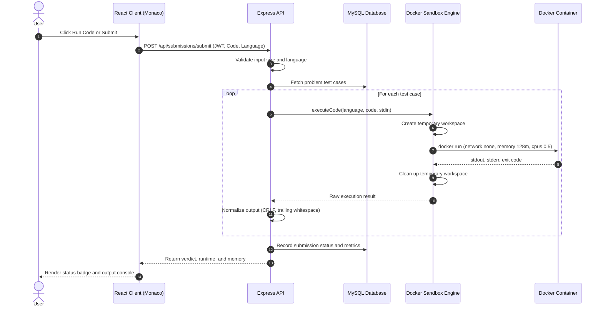

# CodeForge — Secure Online Code Execution & Coding Platform

[](LICENSE)
[](https://nodejs.org/)
[](https://react.dev/)
[](https://www.docker.com/)
[](https://www.mysql.com/)

CodeForge is a full-stack online judge and secure code execution platform built with **React**, **Node.js**, **Express**, **MySQL**, and **Docker**. Inspired by platforms like LeetCode and HackerRank, CodeForge provides an interactive browser IDE powered by Monaco Editor to write, test, and evaluate Python, Java, and C++ code against sample and hidden test suites inside ephemeral, resource-isolated Docker containers.

---

## 🔗 Project Links

* **Source Code Repository:** [https://github.com/Lahari-333/CodeForge](https://github.com/Lahari-333/CodeForge)
* **Frontend Live Demo:** [https://client-omega-cyan-91.vercel.app/](https://client-omega-cyan-91.vercel.app/)
* **Backend API (Local / Dedicated Host):** `http://localhost:5000` (Health: `/api/health`)

> [!NOTE]
> **Architecture Clarification:** The Vercel deployment hosts the production React SPA frontend. CodeForge's backend executes untrusted user submissions inside real, kernel-isolated Docker containers with strict resource quotas. Because serverless environments (e.g., Vercel Serverless) do not permit spawning child Docker containers, the execution backend runs in environments with Docker daemon access (local development or a dedicated VPS / Cloud VM).

---

## 1. Project Overview

CodeForge is designed to simulate a real-world coding assessment platform with a strong emphasis on sandbox security, automated evaluation, and clean developer experience:

* **Interactive Coding:** Users can select problems, write solutions in Python 3.11, Java 17, or C++17, and test them with custom standard input or sample test cases.
* **Automated Judging:** Submissions are automatically compiled (for Java and C++), executed inside unprivileged Docker containers, evaluated against hidden test cases, and assigned verdicts (Accepted, Wrong Answer, Time Limit Exceeded, Memory Limit Exceeded, Compilation Error, Runtime Error).
* **Developer Analytics:** Track submission history, pass rates, language breakdown, execution runtimes, and memory usage over time.
* **Role-Based Administration:** Administrators can manage problems and configure test cases directly through a dedicated admin dashboard.

---

## 2. Key Features

* **Multi-Language Sandboxing:** Securely compile and execute Python 3.11, OpenJDK 17 Java, and GCC 13 C++ inside ephemeral containers.
* **Strict Resource Restrictions:** 128 MB RAM limit, 0.5 CPU quota, max 64 PIDs (fork-bomb prevention), 5-second execution timeout, and disabled networking (`--network none`).
* **Monaco Code Editor:** Browser IDE with syntax highlighting, automatic indentation, bracket matching, line numbers, and dark theme (`vs-dark`).
* **Problem Library:** 10 curated algorithmic problems across Easy, Medium, and Hard difficulty levels with 52 total test cases.
* **Automated Test Evaluation:** Grades code against public sample cases and protected hidden test cases, normalizing line endings (CRLF to LF) and trailing whitespace.
* **Submission History & Analytics:** Tracks runtime execution time (ms), memory usage (MB), test pass rates, and offers read-only code review modals for historical submissions.
* **Interactive Developer Dashboard:** Real-time analytics, 7-day submission volume charts powered by Recharts, and difficulty breakdown progress indicators.
* **Role-Based Admin Panel:** Administrative interface with server-side authorization to create, edit, and delete problems and test cases.

---

## 3. Tech Stack

| Layer | Technology | Purpose |
| :--- | :--- | :--- |
| **Frontend** | React 18, Vite, JavaScript, Tailwind CSS | Single Page Application (SPA) with responsive dark UI |
| **Code Editor** | Monaco Editor (`@monaco-editor/react`) | In-browser code editing with language syntax support |
| **Routing & State** | React Router v6, React Context API | Client-side routing and centralized Auth/Toast state |
| **Visualizations** | Recharts, Lucide React | Dashboard performance charts and developer UI icons |
| **Backend API** | Node.js, Express.js | RESTful API server, middleware, and request validation |
| **Authentication** | JWT (`jsonwebtoken`), `bcryptjs` | Stateless token authentication and salted password hashing |
| **Security Headers** | Helmet, CORS | HTTP security headers and configurable origin policies |
| **Database** | MySQL 8.0 (`mysql2/promise`) | Relational database with connection pooling and transactions |
| **Execution Engine** | Docker Desktop / Docker Engine | Containerized sandbox with cgroups resource limits |

---

## 4. Architecture Overview

The following diagram illustrates the high-level architecture and data flow of CodeForge:



---

## 5. Code Execution Flow



---

## 6. Secure Code Execution & Sandbox Isolation

Executing arbitrary user-submitted code presents inherent security challenges. CodeForge implements multi-layered defensive controls to mitigate common attack vectors:

| Defense Layer | Implemented Control | Threat Mitigated |
| :--- | :--- | :--- |
| **Network Isolation** | `--network none` flag on all execution containers | Prevents SSRF, outbound data exfiltration, and socket scanning |
| **Memory Ceiling** | `-m 128m --memory-swap 128m` | Prevents memory exhaustion attacks and host RAM denial of service |
| **CPU Throttling** | `--cpus 0.5` quota | Prevents 100% CPU thread starvation across host cores |
| **PID Ceiling** | `--pids-limit 64` | Completely neutralizes fork-bombs and runaway process spawning |
| **Execution Watchdog** | 5000ms wall-clock timeout + `docker kill` | Mitigates infinite loops and hung I/O calls |
| **Filesystem Isolation** | Ephemeral `/workspace` mount only | Containers cannot access host files, secrets, or parent directories |
| **Input Redirection** | Stdin piped via `< input.txt` | Ensures clean EOF handling without OS pipe deadlocks |
| **Output Buffer Cap** | 64 KB stdout/stderr buffer ceiling | Prevents host disk and memory flooding from infinite print loops |
| **Non-Root Execution** | Custom unprivileged user `runner` (uid 1001) | Minimizes potential container-escape attack surfaces |
| **Hidden Test Privacy** | Public endpoints filter by `is_sample = TRUE` | Hidden test inputs and expected outputs are never leaked to client |

---

## 7. Supported Languages & Runtime Environment

| Language | Version | Base Image | Compilation Step | Execution Command |
| :--- | :--- | :--- | :--- | :--- |
| **Python** | 3.11 | `codeforge-python:latest` (`python:3.11-alpine`) | Interpreted (None) | `python -u main.py < input.txt` |
| **Java** | OpenJDK 17 | `codeforge-java:latest` (`eclipse-temurin:17-jdk-alpine`) | `javac Main.java` | `java -Xmx128m Main < input.txt` |
| **C++** | GCC 13 (C++17) | `codeforge-cpp:latest` (`alpine:3.19` g++, musl-dev) | `g++ -O2 main.cpp -o main` | `./main < input.txt` |

---

## 8. Project Structure

```
CodeForge/
├── client/                     # React + Vite Frontend
│   ├── src/
│   │   ├── components/         # CodeEditor, OutputPanel, Navbar, ProblemCard, etc.
│   │   ├── context/            # AuthContext, ToastContext
│   │   ├── pages/              # LandingPage, ProblemsPage, ProblemDetailPage, AdminPage, etc.
│   │   ├── services/           # api.js, authService.js, executionService.js
│   │   ├── constants/          # Language starters and configurations
│   │   └── App.jsx             # Route definitions and layouts
│   ├── index.html
│   ├── tailwind.config.js
│   ├── vercel.json             # SPA rewrite routing
│   └── package.json
│
├── server/                     # Node.js + Express REST Backend
│   ├── src/
│   │   ├── config/             # Database connection pool (db.js) and constants
│   │   ├── controllers/        # auth, problem, submission, execution, user
│   │   ├── middleware/         # authMiddleware, adminMiddleware, errorMiddleware
│   │   ├── routes/             # REST endpoint route registrations
│   │   ├── services/           # Business logic layers
│   │   ├── execution/          # dockerEngine.js (Docker sandbox manager)
│   │   ├── utils/              # outputNormalizer.js, responseHelper.js
│   │   ├── validators/         # Input validation schemas
│   │   └── server.js           # Server bootstrap and service health checks
│   ├── tests/                  # Jest & Supertest automated test suites
│   │   ├── unit.test.js        # Output normalizer and constants unit tests
│   │   └── api.test.js         # API integration and authentication tests
│   └── package.json
│
├── docker/                     # Docker sandbox image definitions
│   ├── java/Dockerfile        # OpenJDK 17 Alpine runner
│   ├── python/Dockerfile      # Python 3.11 Alpine runner
│   └── cpp/Dockerfile         # GCC 13 Alpine runner
│
├── docs/                       # Architectural and security documentation
│   ├── architecture.md
│   ├── execution-flow.md
│   ├── security.md
│   └── api.md
│
├── schema.sql                  # MySQL database schema (InnoDB, foreign keys)
├── seed.sql                    # Initial seed data (10 problems, 52 test cases)
├── .env.example                # Safe environment variable template
├── .gitignore                  # Git exclusion rules
└── README.md                   # Project documentation
```

---

## 9. Database Architecture & Seed Data

CodeForge uses a relational MySQL 8 schema designed with foreign key constraints, cascading deletes, and indexes:

* **`users`**: User credentials (bcrypt-hashed passwords), email, username, role (`USER`, `ADMIN`), timestamps.
* **`problems`**: Title, slug, difficulty (`EASY`, `MEDIUM`, `HARD`), description, constraints, starter templates.
* **`test_cases`**: Linked to problems; includes input, expected output, order index, and `is_sample` flag.
* **`submissions`**: Tracks user submissions with language, code, status verdict, runtime (ms), memory (MB), and passed tests.
* **`execution_history`**: Freeform sandbox executions with custom input and terminal output diagnostics.

### Pre-Configured Seed Accounts:
* **Admin Account:** Username: `admin` | Password: `AdminPassword@123` | Role: `ADMIN`
* **Demo Developer:** Username: `demouser` | Password: `DemoPassword@123` | Role: `USER`

---

## 10. API Overview

All API responses follow a consistent JSON format: `{ success: true, data: ... }` or `{ success: false, message: ... }`.

### Authentication & Users
* `POST /api/auth/register` — Register a new developer account
* `POST /api/auth/login` — Authenticate and receive JWT
* `GET /api/auth/me` — Retrieve current authenticated session profile
* `GET /api/users/profile` — User statistics, problem solve counts, and accuracy
* `GET /api/users/dashboard` — Dashboard submission history and 7-day activity metrics

### Problems & Test Cases
* `GET /api/problems` — List all published problems with difficulty filtering
* `GET /api/problems/:slug` — Get problem details with sample test cases (hidden tests excluded)
* `POST /api/problems` — Create a new problem (Admin only)
* `PUT /api/problems/:id` — Update existing problem (Admin only)
* `DELETE /api/problems/:id` — Remove problem (Admin only)

### Execution & Submissions
* `POST /api/execute` — Execute freeform code in sandbox with custom stdin
* `POST /api/submissions/run` — Run code against problem sample test cases
* `POST /api/submissions/submit` — Submit code against all sample and hidden test cases
* `GET /api/submissions` — Retrieve authenticated user submission history
* `GET /api/submissions/:id` — Retrieve submission details and code

### System Health
* `GET /api/health` — Returns status of API, database connection, and Docker engine

---

## 11. Environment Variables Reference

Copy `.env.example` to create your local `server/.env`:

```bash
cp .env.example server/.env
```

```env
PORT=5000
NODE_ENV=development
CLIENT_URL=http://localhost:5173

# MySQL Database Configuration
DB_HOST=localhost
DB_PORT=3306
DB_USER=root
DB_PASSWORD=your_mysql_password
DB_NAME=codeforge_db

# Authentication
JWT_SECRET=your_super_secret_jwt_key_at_least_32_characters_long
JWT_EXPIRES_IN=7d

# Code Execution Limits
EXECUTION_TIMEOUT_MS=5000
EXECUTION_MEMORY_LIMIT=128m
EXECUTION_CPU_LIMIT=0.5
EXECUTION_MAX_OUTPUT_BYTES=65536
EXECUTION_MAX_CODE_BYTES=65536
DOCKER_CONTAINER_PREFIX=codeforge-runner-

# Docker Sandbox Images
DOCKER_IMAGE_JAVA=codeforge-java:latest
DOCKER_IMAGE_PYTHON=codeforge-python:latest
DOCKER_IMAGE_CPP=codeforge-cpp:latest
```

---

## 12. Docker Setup

Ensure Docker Desktop or Docker Engine is running on your system, then build the execution images from the project root:

```bash
# Build Java sandbox image
docker build -t codeforge-java:latest ./docker/java

# Build Python sandbox image
docker build -t codeforge-python:latest ./docker/python

# Build C++ sandbox image
docker build -t codeforge-cpp:latest ./docker/cpp
```

Verify images are built:
```bash
docker images codeforge-*
```

---

## 13. Local Setup & Running the Application

### 1. Prerequisites
* **Node.js**: v18+ (tested on `v24.16.0`)
* **MySQL Server**: 8.0 running on port 3306
* **Docker**: Docker Desktop (with WSL2 on Windows) or Docker Engine on Linux/macOS

### 2. Clone & Install
```bash
git clone https://github.com/Lahari-333/CodeForge.git
cd CodeForge

# Install server dependencies
cd server
npm install

# Install client dependencies
cd ../client
npm install
```

### 3. Database Initialization
```bash
# Run database seed script from server directory
cd server
node src/db/seed.js
```

### 4. Start the Application
In Terminal 1 (Backend API):
```bash
cd server
npm run dev
# Running at http://localhost:5000
```

In Terminal 2 (Frontend Client):
```bash
cd client
npm run dev
# Running at http://localhost:5173
```

---

## 14. Testing Instructions

CodeForge includes an automated Jest and Supertest suite:

```bash
cd server
npm test
```

### Test Coverage Summary:
* **Unit Tests (`tests/unit.test.js`)**: Output normalization (CRLF conversion, trailing whitespace trimming), output comparison equivalence, language configurations, execution status definitions.
* **API Tests (`tests/api.test.js`)**: Health checks, user registration, duplicate prevention, password validation, JWT issuance and authentication middleware, role-based authorization (admin vs user), public problem queries, and hidden test case filtering.
* **Result**: **22 passed, 22 total** across 2 test suites.

---

## 15. Production Deployment Architecture

```
[ User Browser ]
       |
       | HTTPS
       v
[ Vercel Edge Network ]  -----> Serves React 18 SPA (client/dist)
       |
       | REST API / HTTPS
       v
[ Cloud VM / VPS (Ubuntu 22.04 LTS) ]
    ├── Reverse Proxy (Nginx + SSL / Let's Encrypt)
    ├── Node.js Express API (systemd / PM2)
    └── Docker Daemon
            ├── codeforge-java Sandbox (isolated container)
            ├── codeforge-python Sandbox (isolated container)
            └── codeforge-cpp Sandbox (isolated container)
       |
       | TLS (Port 3306)
       v
[ Managed MySQL Database (AWS RDS / DigitalOcean Managed DB) ]
```

### Hosting Requirements for Code Execution:
Standard serverless or containerized PaaS platforms (e.g., Vercel Serverless, basic Render Web Services) run inside restricted containers without root daemon permissions or access to `/var/run/docker.sock`. Because CodeForge dynamically invokes `docker run` with strict kernel flags (`--network none`, `--cpus`, `-m`), the backend must run in an environment with native Docker daemon access (such as an AWS EC2 instance, DigitalOcean Droplet, or Hetzner VPS).

---

## 16. Live Demo & Verified Links

* **Frontend Live Demo:** [https://client-omega-cyan-91.vercel.app/](https://client-omega-cyan-91.vercel.app/)
* **GitHub Repository:** [https://github.com/Lahari-333/CodeForge](https://github.com/Lahari-333/CodeForge)
* **Backend Status:** Runs locally or on a provisioned Docker-enabled VM.

---

## 17. Security Model & Platform Constraints

* **Defensive Sandbox Scope:** CodeForge implements multi-tenant Docker sandboxing with network isolation, non-root users, CPU/RAM quotas, PID limits, and watchdog timers.
* **Kernel Sharing Limitation:** Standard Docker containers share the host Linux kernel. This architecture is suitable for developer portfolio demonstrations and educational platforms. Production commercial platforms (such as LeetCode or AWS Lambda) typically employ micro-virtualization layers (such as AWS Firecracker or Google gVisor `runsc`) to establish hardware-level boundaries.

---

## 18. Known Limitations & Future Improvements

### Known Limitations
* **Docker Daemon Dependency:** On Windows hosts, Docker Desktop must remain running with the WSL2 backend. If Docker is offline, the API returns a structured `SYSTEM_ERROR` without crashing.
* **Synchronous Execution Pipeline:** Submissions currently execute sequentially per test case; high-concurrency loads benefit from a distributed Redis/BullMQ worker queue.

### Future Improvements
* Integration of **Google gVisor (`runsc`)** for kernel-independent OCI sandboxing.
* Asynchronous job queue using **Redis & BullMQ** with worker pool scaling.
* Real-time output streaming via **WebSockets / Server-Sent Events (SSE)**.
* Timed contests, leaderboard rankings, and user rating calculations.

---

## 19. Author & License

* **Developer:** Lahari ([@Lahari-333](https://github.com/Lahari-333))
* **Project Repository:** [https://github.com/Lahari-333/CodeForge](https://github.com/Lahari-333/CodeForge)
* **License:** [MIT License](LICENSE)
