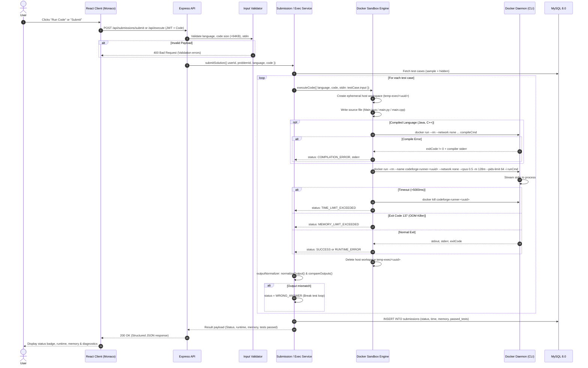

# CodeForge Execution Flow

This document details the lifecycle of code execution within CodeForge, from the moment a user presses "Run Code" or "Submit" to the delivery and display of the graded result.

---

## 1. Sequence Diagram

---

## 2. Step-by-Step Lifecycle Explanation

1. **Client Submission:** The developer selects their language (Java, Python, or C++) and edits their solution. Clicking "Submit" triggers a request containing `problemId`, `language`, and `code`.
2. **Authentication & Authorization:** The backend verifies the Bearer JWT token in the `Authorization` header.
3. **Validation:** The request passes through `validateExecution`, checking that the language is supported, code is non-empty, and UTF-8 byte length does not exceed 64 KB.
4. **Test Case Retrieval:** The backend queries MySQL to retrieve all configured test cases for the problem (ordered by public sample cases followed by hidden evaluation cases).
5. **Workspace Isolation:** For each test case, the execution manager generates an execution UUID and creates a unique directory under `server/temp-exec/<uuid>`. The source file is written with strict non-root ownership.
6. **Compilation Phase (Java & C++):**
   * Java: `javac Main.java` inside `codeforge-java:latest`.
   * C++: `g++ -O2 main.cpp -o main` inside `codeforge-cpp:latest`.
   * If compilation fails, the compiler diagnostic output is captured, the temporary workspace is purged, and `COMPILATION_ERROR` is immediately returned without executing arbitrary code.
7. **Execution Phase:**
   * An isolated container is launched with flags: `--network none --cpus 0.5 -m 128m --memory-swap 128m --pids-limit 64 --rm`.
   * Stdin is piped to the process.
   * A 5-second watchdog timer monitors the process.
   * An output size monitor halts the container if output exceeds 64 KB (`OUTPUT_LIMIT_EXCEEDED`).
8. **Output Normalization:**
   * CRLF and CR are normalized to standard LF line-endings (`\n`).
   * Trailing whitespace from every line is trimmed.
   * Trailing blank lines are stripped.
   * The normalized string is compared with the expected output.
9. **Result Recording:**
   * Results are persisted in MySQL in `submissions` (or `execution_history` for custom editor runs).
   * For hidden test cases, test input and expected outputs are never exposed to the client.
10. **Cleanup:**
    * Ephemeral containers are removed by Docker (`--rm` or explicit `docker kill`).
    * Host temporary directories are deleted recursively in a `finally` block.
